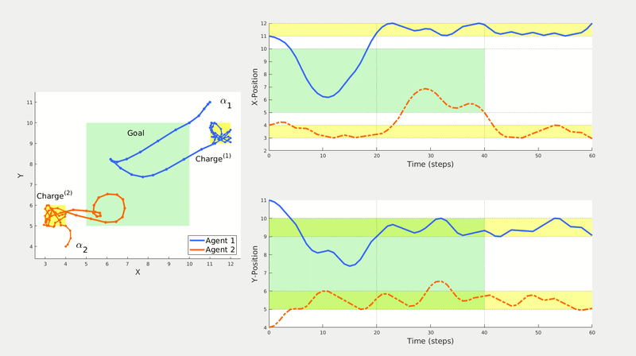

# time-robust-control

MILP implementation described in ``Time-Robust Control for STL Specifications'' by A. Rodionova, L. Lindemann, M. Morari and G. J. Pappas, submitted to CDC 2021.

Multi-Agent Surveillance. Simulations are available [here](https://tinyurl.com/multi-surveil) and [here](https://tinyurl.com/rob-feasibility).

To replicate the experiments from the paper (folder [tests](https://github.com/nellro/time-robust-control/tree/main/tests)), you will also need: 
- MATLAB.
- [YALMIP toolbox](https://yalmip.github.io/).
- [Gurobi optimizer](https://www.gurobi.com/products/gurobi-optimizer/).
  - if you don't want to install Gurobi, you might use any other solver you prefer ([mosek](https://www.mosek.com/), for instance). Computation times might change.
